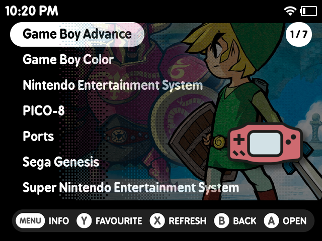
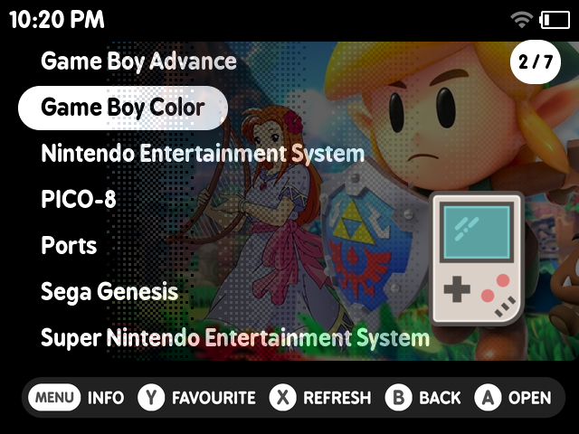
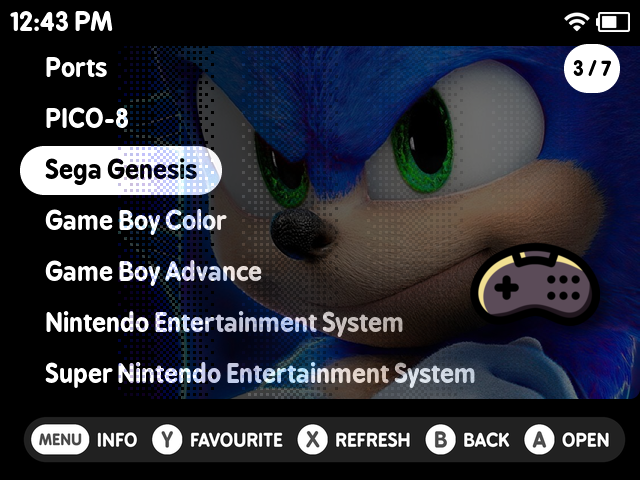
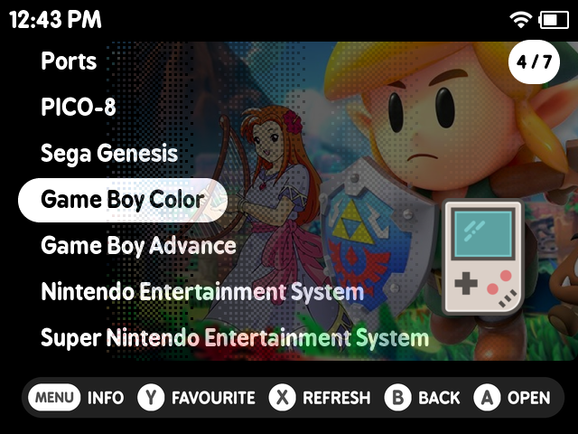
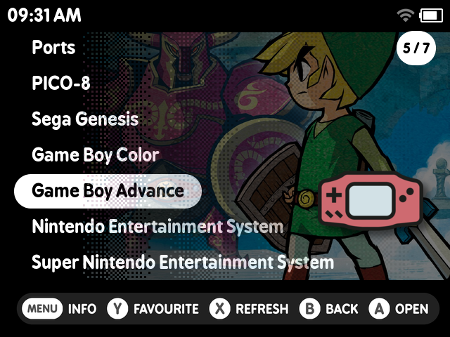
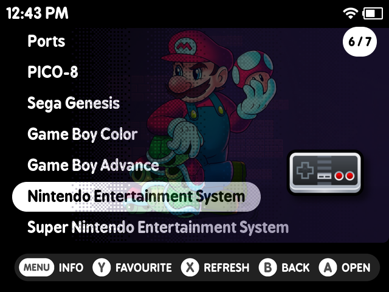
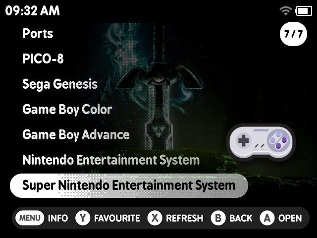

# muOS Artwork Maker

## Description
This script for muOS users allows to manually make artwork for systems like NES, SNES, and more. It is particularly useful when the automated tool [Scrappy](https://github.com/gabrielfvale/scrappy) fails to generate the required 3px dither art. The script requires the user to provide a base image (Check `base.png` file in example folder) and a logo/icon/boxart (Check `icon.png` file in example folder).

While Scrappy can generate artwork automatically for many systems, this script offers manual intervention when Scrappy does not work as expected. Additionally, you can use this script to generate artwork for a system itself.

## Requirements
- **ImageMagick**: Ensure that the `magick` command is available on your system. You can install it with the following:
  - For Linux (Ubuntu/Debian): `sudo apt-get install imagemagick`
  - For Linux (Fedora): `sudo dnf install imagemagick`
  - For macOS: `brew install imagemagick`
  
- **Zenity**: This script uses Zenity for the user interface. Ensure it is installed:
  - For Linux (Ubuntu/Debian): `sudo apt-get install zenity`
  - For Linux (Fedora): `sudo dnf install zenity`
  - For macOS: `brew install zenity`

## Screenshots








## How to Use
1. **Prepare Your Files**:
   - **Base Image**: This will be your base image for the artwork.
   - **Logo/Icon**: This is the logo/icon/boxart of a ROM/game. You can find icons on sites like [Flaticon](https://www.flaticon.com/). It should be in .png format and must have a transparent background.

2. **Run the Script**:
   - Clone the repository:
     ```
     git clone https://github.com/saitamasahil/muOS-Artwork-Maker.git
     ```
   - Run the script:
     ```
     chmod +x main.sh && ./main.sh
     ```
   - Select `Base Image` and `Logo/Icon/Boxart` from the file explorer.
   - You can find an example folder in the repository that includes sample for base image & icon.
   - Enter the name for output file (Without extension).
   - Choose the resolution for your output according to your screen resolution.
   - If you want to add shadow to Logo/Icon/Boxart then choose Yes, Otherwise choose No.
   - The output file will be generated as a PNG image in directory where you cloned the repository in output folder.

3. **Saving Output**:
   After generating the artwork, you must place the output file in the correct directory:
   - For a game or ROM, the output file should be placed in the following path:
     ```
     /mnt/mmc/MUOS/info/catalogue/<system-name>/box
     ```
   - If you generated artwork for a specific system, place the file in:
     ```
     /mnt/mmc/MUOS/info/catalogue/Folder/box
     ```
   - The output PNG file name should match the name of the game, ROM, or system folder.

4. **muOS Configuration**:
   After placing the output file in the correct directory, Go to Settings > General Settings > Interface Options > Content Box Art - Change it to `Front` & Content Box Art Alignment - Change it to `Bottom Right`.

5. **Note on Logo/Icon/Boxart**:
   - It can be a logo, icon or a box art image of a ROM/game/system. If you want to use this image as an icon, you can use [Flaticon](https://www.flaticon.com/) to find icons. Alternatively, you can use a box art image of the ROM/game.

## Why Use This Script?
- **Manual Artwork Generation**: If Scrappy fails to generate the 3px dither art, this script lets you manually create artwork for your games. Additionally, you can use this script to generate artwork for a system itself.
- **Customization**: You can adjust the `Logo/Icon/Boxart` and `Base Image` to generate artwork tailored to your needs.

## License
This script is licensed under the GPLv3 License. See the [LICENSE](LICENSE) file for details.